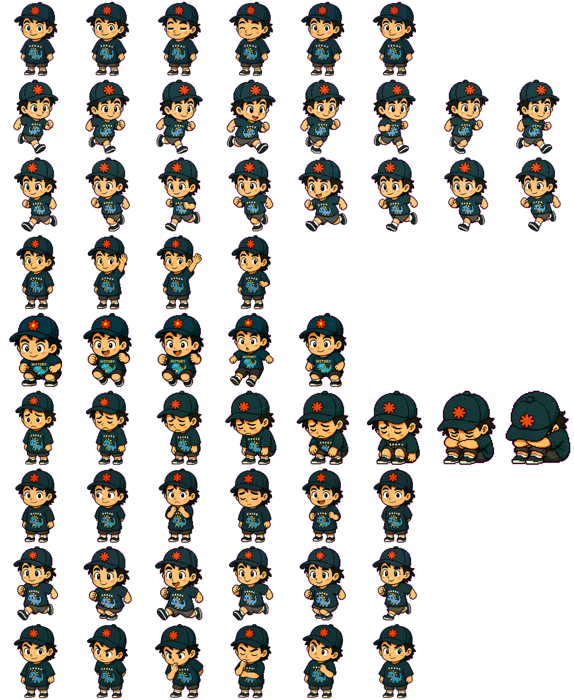

# LittleI Codex Pet

LittleI is a compact expressive Codex digital pet based on a playful history-shirt character with a flower cap.

## Preview



## Files

- `pet.json` - Codex pet metadata. The pet id is `littlei` and the display name is `LittleI`.
- `spritesheet.webp` - 1536 x 1872 WebP atlas using 192 x 208 cells.

## Install Option 1: Import With `$hatch-pet`

If you use Codex with the local [`$hatch-pet`](/Users/hobeter/.codex/skills/hatch-pet/SKILL.md) skill, open this repository in Codex and ask:

```text
Use $hatch-pet to import this finished pet into my Codex pets directory.
Use pet.json and spritesheet.webp from the current repository.
```

The expected installed layout is:

```text
${CODEX_HOME:-$HOME/.codex}/pets/littlei/
  pet.json
  spritesheet.webp
```

## Install Option 2: Manual Copy

Create the Codex pet folder and copy both files into it:

```bash
mkdir -p "${CODEX_HOME:-$HOME/.codex}/pets/littlei"
cp pet.json spritesheet.webp "${CODEX_HOME:-$HOME/.codex}/pets/littlei/"
```

After copying, restart or refresh Codex so it can discover the new pet.
